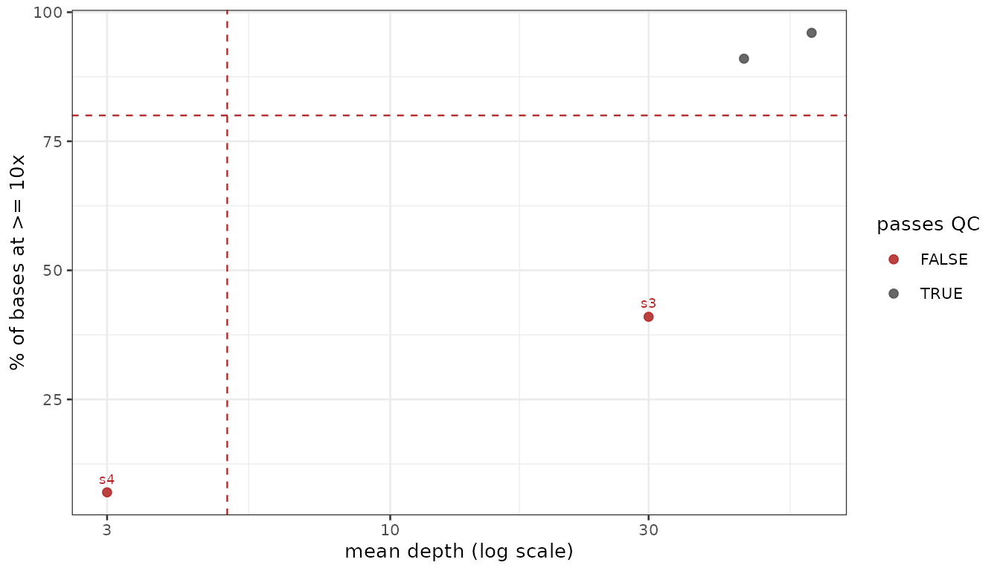

# Coverage QC

``` r

library(plasgenomicsutilsR)
```

The depth tables come from the Python package
(`plasgenomicsutils coverage_depth_stats` and
`coverage_dropout_regions`, which read the BAMs); this package reads and
plots them.

``` r

cov <- read_coverage("coverage_by_sample.tsv.gz")
coverage_qc(cov, threshold = 10, min_mean = 5, min_breadth = 80)   # one row per sample
plot_coverage_summary(cov)     # mean vs breadth, failures labelled
plot_coverage_by_chrom(cov)    # sample x chromosome, relative to each sample's own mean

plot_coverage_dropout(read_coverage("coverage_windows.tsv.gz"),
                      genes = PF_EXAMPLE_DRUG_GENES)
```

Breadth matters more than mean depth: selective whole-genome
amplification can give a respectable average while leaving much of the
genome at zero, and only the `pct_ge_10x`-style column shows that. On
one real cohort the sample that failed QC had a mean of 122x — and a
median of 33x with a quarter of the core genome under 10x.

Two things to keep straight when generating those tables. The depth
engines do not agree by definition: `mosdepth` counts **fragments** (an
overlapping mate pair once) while `pysam`/`samtools depth` count
**reads**, which puts mosdepth a couple of percent lower everywhere.
Fragment depth is the better measure of independent evidence; either is
fine as long as a cohort uses one, and the `engine` column records
which. And
[`plot_coverage_dropout()`](https://nickjhathaway.github.io/plasgenomicsutilsR/reference/plot_coverage_dropout.md)
earns its place on the cross-sample question — a window empty in
*everyone* is not missing data, it silently reads as invariant.

## What the table looks like

The two floors are independent, and `fail_reason` says which one a
sample missed:

``` r

cov <- data.frame(
  sample = paste0("s", 1:4), chrom = "genome",
  mean   = c(60, 45, 30, 3),
  # s3 is deep on average but narrow -- amplification, not a shallow run
  pct_ge_10x = c(96, 91, 41, 7)
)
coverage_qc(cov)
#> # A tibble: 4 × 5
#>   sample  mean pct_ge_10x pass  fail_reason          
#>   <chr>  <dbl>      <dbl> <lgl> <chr>                
#> 1 s4         3          7 FALSE low depth and breadth
#> 2 s3        30         41 FALSE low breadth          
#> 3 s2        45         91 TRUE  NA                   
#> 4 s1        60         96 TRUE  NA
```

[`plot_coverage_summary()`](https://nickjhathaway.github.io/plasgenomicsutilsR/reference/plot_coverage_summary.md)
draws the same two numbers against each other with both floors marked,
so the failures separate along whichever axis they failed on – which is
the quickest way to tell a shallow run from an uneven one.

``` r

plot_coverage_summary(cov)
```


