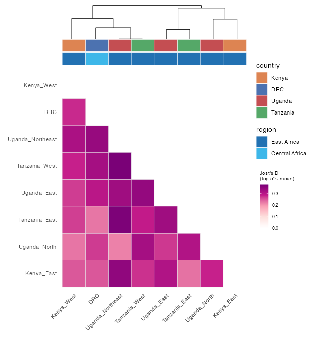

# Population differentiation

[`pop_diff()`](https://nickjhathaway.github.io/plasgenomicsutilsR/reference/pop_diff.md)
computes a per-SNP differentiation statistic for every pair of metadata
groups, from the **full, unpruned** genotypes (LD-pruning throws away
the differentiating SNPs you want here): **Jost’s D**
([`jost_d()`](https://nickjhathaway.github.io/plasgenomicsutilsR/reference/jost_d.md)),
**Nei’s Gst**, **Hedrick’s standardized G′st**, and **Hudson’s Fst**.

``` r

ps <- example_pop_structure("africa")
pd <- ps$pop_diff(group = "site", statistic = "jost_d")   # per-SNP D for all site pairs
pd
```

## Reading near-zero measures

Across the whole *P. falciparum* genome most SNPs barely differ between
African populations, so a genome-wide **mean** differentiation looks
close to zero even where real structure exists in a minority of loci.
Options that surface it:

- summarise with `stat = "top_mean"` (mean of the top few % of SNPs per
  pair) or `"max"` rather than `"mean"`;
- apply a `trans = "sqrt"` fill to the heatmap;
- remember the differentiation lives in the **loci** —
  [`top_differentiating_snps()`](https://nickjhathaway.github.io/plasgenomicsutilsR/reference/top_differentiating_snps.md)
  and a per-SNP genome scan are the right lens, not the genome-wide
  average.

Nei’s Gst is the most deflated when within-group diversity is high;
Jost’s D and Hedrick’s G′st are less so.

## Everything in one table

[`pop_diff_table()`](https://nickjhathaway.github.io/plasgenomicsutilsR/reference/pop_diff_table.md)
gathers every statistic and summary per group pair, side by side:

``` r

ps$pop_diff_table(group = "site")
#>          a         b n_snps jost_d_mean jost_d_top_mean jost_d_max gst_mean ...
#> 1      DRC  Uganda_N   2000       0.040           0.268      0.628    0.029 ...
#> ...
```

## Triangle heatmap

[`plot_diff_heatmap()`](https://nickjhathaway.github.io/plasgenomicsutilsR/reference/plot_diff_heatmap.md)
draws a lower-triangle heatmap with the fill legend tucked in the empty
corner, an optional clustering **dendrogram**, and one or more metadata
**annotation** strips with custom colours:

``` r

ps$plot_diff_heatmap(
  group = "site", statistic = "jost_d", stat = "top_mean",
  annotate = c("country", "region"),                         # two annotation strips
  annotate_colours = list(country = c(DRC = "#4C72B0", Kenya = "#DD8452",
                                      Tanzania = "#55A868", Uganda = "#C44E52")))
```



## Selecting markers

[`top_differentiating_snps()`](https://nickjhathaway.github.io/plasgenomicsutilsR/reference/top_differentiating_snps.md)
returns the most differentiating SNPs, walking the pairwise comparisons
round-robin so each pair contributes its top loci. (This is exactly how
the `"africa"` example fixture is built.)

``` r

markers <- top_differentiating_snps(pd, 2000)
```

Estimators follow Jost (2008), Nei & Chesser (1983), Hedrick (2005), and
Hudson et al. (1992) / Bhatia et al. (2013); see
[`?pop_diff`](https://nickjhathaway.github.io/plasgenomicsutilsR/reference/pop_diff.md)
for the references.
