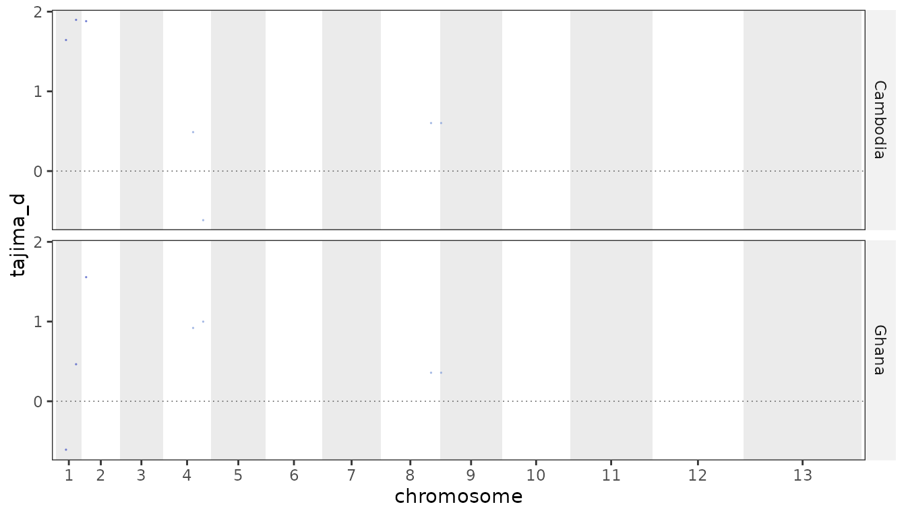
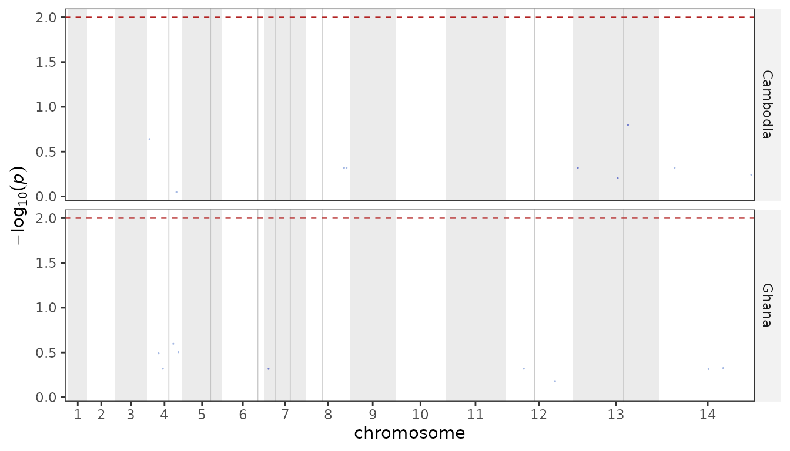
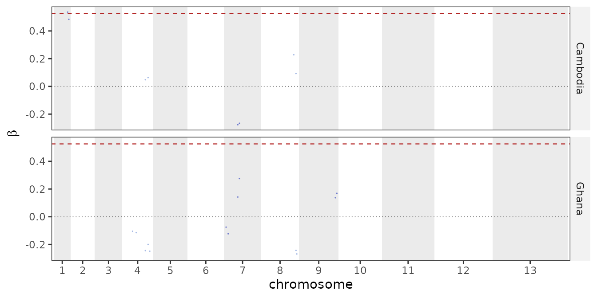

# Diversity, linkage and selection

Three questions about a cohort, each answered from the same genotype
matrix and the same metadata grouping: how diverse is each population,
how far does linkage reach, and which loci are under selection.

The example fixture is deliberately tiny (60 samples, 49 SNPs), so the
numbers below are shaped by that, not by biology. Everything scales to a
real callset unchanged.

``` r

ps <- example_pop_structure(umap = FALSE)
```

## Diversity

[`pop_diversity()`](https://nickjhathaway.github.io/plasgenomicsutilsR/reference/pop_diversity.md)
reports, per group: nucleotide diversity, expected heterozygosity,
Watterson’s theta, Tajima’s D, and the haplotype / multilocus-genotype
summaries.

``` r

pop_diversity(ps, group = "country", accessible = PF3D7_CORE_REGIONS)
#> # A tibble: 2 × 24
#>   group chr   start   end unit  n_samples n_snps n_sites seg_sites    he      pi
#>   <fct> <chr> <dbl> <dbl> <chr>     <int>  <int>   <dbl>     <int> <dbl>   <dbl>
#> 1 Camb… NA       NA    NA geno…        30     49  2.09e7        24 0.159 3.74e-7
#> 2 Ghana NA       NA    NA geno…        30     49  2.09e7        36 0.194 4.56e-7
#> # ℹ 13 more variables: theta_w <dbl>, tajima_d <dbl>, tajima_p <dbl>,
#> #   n_taj_snps <int>, n_taj_samples <dbl>, n_hap_snps <int>,
#> #   n_hap_samples <int>, n_hap <int>, hap_div <dbl>, shannon_h <dbl>,
#> #   simpson_lambda <dbl>, evenness <dbl>, tajima_percentile <dbl>
```

### pi and He are not the same number

This is the one thing worth being careful about. **`pi` is per
accessible base pair** – the sum of per-site heterozygosity divided by
the number of callable sites. **`he`** is that same per-site quantity
averaged over the **SNPs**. They differ by a factor of several thousand
and only one of them is comparable between windows:

``` r

d <- pop_diversity(ps, group = "country", accessible = PF3D7_CORE_REGIONS)
d[c("group", "n_snps", "n_sites", "he", "pi")]
#> # A tibble: 2 × 5
#>   group    n_snps  n_sites    he          pi
#>   <fct>     <int>    <dbl> <dbl>       <dbl>
#> 1 Cambodia     49 20857252 0.159 0.000000374
#> 2 Ghana        49 20857252 0.194 0.000000456
```

Dividing by the SNP count instead of the base count is the usual
mistake, and it makes windows with different SNP density or missingness
silently incomparable. `accessible` sets the denominator; without it
every base of the unit is assumed callable, which is only right if your
VCF really was called across the whole span.

### Per gene, or in windows

Per gene is the convention for *P. falciparum* Tajima’s D – coding SNPs,
at least three of them, no MAF filter:

``` r

pop_diversity(ps, group = "country", by = "gene",
              genes = PF_EXAMPLE_DRUG_GENES)[1:4, c("group", "unit", "n_snps", "he")]
#> # A tibble: 4 × 4
#>   group    unit   n_snps    he
#>   <fct>    <chr>   <int> <dbl>
#> 1 Cambodia pfcrt       0    NA
#> 2 Cambodia pfdhfr      0    NA
#> 3 Cambodia pfmdr1      0    NA
#> 4 Cambodia pfdhps      0    NA
```

Windows give a genome-wide track. `step` slides the window rather than
tiling it, which is the usual way to scan Tajima’s D — a fixed grid can
split a signal across two windows and dilute it in both:

``` r

win <- pop_diversity(ps, group = "country", by = "window", window = 500000, step = 250000)
plot_diversity(win, metric = "tajima_d")
```



On a real callset `window = 5000, step = 2500` is a reasonable scanning
resolution. Overlapping windows are not independent, so count *peaks*,
not windows — \[selection_peaks()\] does that.

`tajima_p` tests each unit against the standard neutral model, and
`tajima_percentile` places its D within the group’s own distribution.
Prefer the percentile for shortlisting: see
[`?tajima_d_pvalue`](https://nickjhathaway.github.io/plasgenomicsutilsR/reference/tajima_d_pvalue.md)
for why the parametric test is conservative here.

### Haploid genotypes, mixed infections

The parasite is haploid, so a heterozygous call is a mixed infection at
that site rather than a diploid genotype. By default those calls are
dropped at that site (`het = "missing"`) and every allele count is a
count of samples; `het = "dosage"` splits the call between the two
alleles instead.

Tajima’s D needs one sample count for its variance term, but sites
differ in how many calls they have. Rather than discard every sample
with a gap, all sites are kept and the mean number of calls is used as
*n* – `n_taj_snps` and `n_taj_samples` report what went in. The
haplotype-based columns (`hap_div`, `shannon_h`, `simpson_lambda`) do
need complete data, and there something has to give: either the samples
with a gap or the sites. Sites are the plentiful axis, so the sites with
any missing call are dropped and every sample stays in the comparison
(`n_hap_snps` reports what survived). Dropping samples instead would be
hopeless at scale — at 0.05% missingness over 27,000 SNPs a sample
survives with probability ~1e-6.

Note that haplotype diversity is a *per-locus* statistic: genome-wide it
saturates at 1, because over thousands of SNPs every sample is its own
haplotype. Use `by = "gene"` or `by = "window"` for it to say anything.

## Linkage disequilibrium

Two views, and they live on different sides of the split. **r-squared
decay** with physical distance is the one genuinely quadratic statistic
here – every SNP against every other SNP within `max_dist` – so it runs
in the Python package, where it takes about 7 seconds on a 249-sample,
28k-SNP callset:

``` bash
plasgenomicsutils ld_decay --vcf cohort.bcf --meta meta.tsv --group-col region \
  --max-dist 50000 --bins 20 --output ld/decay.tsv.gz --half-decay-output ld/half.tsv
```

[`read_ld_decay()`](https://nickjhathaway.github.io/plasgenomicsutilsR/reference/read_ld_decay.md)
brings it back, with the half-decay distance and the scan settings
attached so the thinning behind a curve travels with it:

``` r

ld <- read_ld_decay("ld/decay.tsv.gz", "ld/half.tsv")
attr(ld, "ld_half_decay")
plot_ld_decay(ld)
```

**[`ld_index()`](https://nickjhathaway.github.io/plasgenomicsutilsR/reference/ld_index.md)**
is the multilocus view and stays here, being linear and quick: `Ia` and
its standardised form `rbarD`, both 0 under free recombination and
rising as reproduction becomes clonal. Compare `rbarD` between datasets,
since `Ia` grows with the number of loci.

``` r

ld_index(ps, group = "country")
#> # A tibble: 2 × 5
#>   group    n_samples n_loci      ia   rbar_d
#>   <fct>        <int>  <int>   <dbl>    <dbl>
#> 1 Cambodia        30     14  0.887   0.0704 
#> 2 Ghana           30     25 -0.0422 -0.00184
```

Both are **upward-biased in small samples**, so read them next to
`n_samples` – a group of ten will score above a group of a hundred drawn
from the same population.

## Selection

Two complementary scans. Directional sweeps (drug resistance) show up in
extended haplotype homozygosity; long-term balancing selection
(antigens) shows up in clustered allele frequencies.

### Haplotypes first

needs phased haplotypes with no missing calls, and a *P. falciparum* VCF
has neither.
[`parasite_haplotypes()`](https://nickjhathaway.github.io/plasgenomicsutilsR/reference/parasite_haplotypes.md)
is the bridge, and it reports every sample and SNP it removed – how the
haplotypes were made determines what the scan can honestly claim.

``` r

hap <- parasite_haplotypes(ps, maf = 0.05)
hap
#> <parasite_haplotypes> 60 haplotypes x 27 SNPs
#>   from            : 60 samples x 49 SNPs
#>   mixed calls     : 79 resolved by allele draw 
#>   SNPs dropped    : 12 missing, 10 MAF
#>   samples dropped : 0 missing
#>   imputed calls   : 16  seed: 42
```

With per-sample Fws to hand (from `plasgenomicsutils calculate_fws`),
gate to monoclonal infections first, since a polyclonal infection is a
mixture of haplotypes rather than one:

``` r

fws <- readr::read_tsv("fws.tsv")
hap <- parasite_haplotypes(ps, fws = fws, min_fws = 0.95, maf = 0.03)
```

Both the mixed-call resolution and the imputation are random draws at
the population allele frequency. `seed` makes a run reproducible – and a
signal worth reporting should survive repeating the whole thing under a
different seed.

### iHS, Rsb and XP-EHH

``` r

ihs <- run_ihs(hap, group = "country")
#> Warning: If alleles are unpolarized, 'freqbin' should be set to 1 (one bin).
#> Warning in rehh::ihh2ihs(scan, freqbin = freqbin, min_maf = min_maf, verbose =
#> FALSE): The number of markers with allele frequencies in bin [0.05,0.1) is less
#> than 10: you should probably increase bin width.
#> Warning in rehh::ihh2ihs(scan, freqbin = freqbin, min_maf = min_maf, verbose =
#> FALSE): The number of markers with allele frequencies in bin [0.1,0.15) is less
#> than 10: you should probably increase bin width.
#> Warning in rehh::ihh2ihs(scan, freqbin = freqbin, min_maf = min_maf, verbose =
#> FALSE): The number of markers with allele frequencies in bin [0.15,0.2) is less
#> than 10: you should probably increase bin width.
#> Warning in rehh::ihh2ihs(scan, freqbin = freqbin, min_maf = min_maf, verbose =
#> FALSE): The number of markers with allele frequencies in bin [0.2,0.25) is less
#> than 10: you should probably increase bin width.
#> Warning in rehh::ihh2ihs(scan, freqbin = freqbin, min_maf = min_maf, verbose =
#> FALSE): The number of markers with allele frequencies in bin [0.25,0.3) is less
#> than 10: you should probably increase bin width.
#> Warning in rehh::ihh2ihs(scan, freqbin = freqbin, min_maf = min_maf, verbose =
#> FALSE): The number of markers with allele frequencies in bin [0.3,0.35) is less
#> than 10: you should probably increase bin width.
#> Warning in rehh::ihh2ihs(scan, freqbin = freqbin, min_maf = min_maf, verbose =
#> FALSE): The number of markers with allele frequencies in bin [0.35,0.4) is less
#> than 10: you should probably increase bin width.
#> Warning in rehh::ihh2ihs(scan, freqbin = freqbin, min_maf = min_maf, verbose =
#> FALSE): The number of markers with allele frequencies in bin [0.4,0.45) is less
#> than 10: you should probably increase bin width.
#> Warning in rehh::ihh2ihs(scan, freqbin = freqbin, min_maf = min_maf, verbose =
#> FALSE): The number of markers with allele frequencies in bin [0.45,0.5) is less
#> than 10: you should probably increase bin width.
#> Warning in rehh::ihh2ihs(scan, freqbin = freqbin, min_maf = min_maf, verbose =
#> FALSE): The number of markers with allele frequencies in bin [0.5,0.55) is less
#> than 10: you should probably increase bin width.
#> Warning in rehh::ihh2ihs(scan, freqbin = freqbin, min_maf = min_maf, verbose =
#> FALSE): The number of markers with allele frequencies in bin [0.55,0.6) is less
#> than 10: you should probably increase bin width.
#> Warning in rehh::ihh2ihs(scan, freqbin = freqbin, min_maf = min_maf, verbose =
#> FALSE): The number of markers with allele frequencies in bin [0.6,0.65) is less
#> than 10: you should probably increase bin width.
#> Warning in rehh::ihh2ihs(scan, freqbin = freqbin, min_maf = min_maf, verbose =
#> FALSE): The number of markers with allele frequencies in bin [0.65,0.7) is less
#> than 10: you should probably increase bin width.
#> Warning in rehh::ihh2ihs(scan, freqbin = freqbin, min_maf = min_maf, verbose =
#> FALSE): The number of markers with allele frequencies in bin [0.7,0.75) is less
#> than 10: you should probably increase bin width.
#> Warning in rehh::ihh2ihs(scan, freqbin = freqbin, min_maf = min_maf, verbose =
#> FALSE): The number of markers with allele frequencies in bin [0.75,0.8) is less
#> than 10: you should probably increase bin width.
#> Warning in rehh::ihh2ihs(scan, freqbin = freqbin, min_maf = min_maf, verbose =
#> FALSE): The number of markers with allele frequencies in bin [0.8,0.85) is less
#> than 10: you should probably increase bin width.
#> Warning in rehh::ihh2ihs(scan, freqbin = freqbin, min_maf = min_maf, verbose =
#> FALSE): The number of markers with allele frequencies in bin [0.85,0.9) is less
#> than 10: you should probably increase bin width.
#> Warning in rehh::ihh2ihs(scan, freqbin = freqbin, min_maf = min_maf, verbose =
#> FALSE): The number of markers with allele frequencies in bin [0.9,0.95) is less
#> than 10: you should probably increase bin width.
#> Warning: If alleles are unpolarized, 'freqbin' should be set to 1 (one bin).
#> Warning in rehh::ihh2ihs(scan, freqbin = freqbin, min_maf = min_maf, verbose =
#> FALSE): The number of markers with allele frequencies in bin [0.05,0.1) is less
#> than 10: you should probably increase bin width.
#> Warning in rehh::ihh2ihs(scan, freqbin = freqbin, min_maf = min_maf, verbose =
#> FALSE): The number of markers with allele frequencies in bin [0.1,0.15) is less
#> than 10: you should probably increase bin width.
#> Warning in rehh::ihh2ihs(scan, freqbin = freqbin, min_maf = min_maf, verbose =
#> FALSE): The number of markers with allele frequencies in bin [0.15,0.2) is less
#> than 10: you should probably increase bin width.
#> Warning in rehh::ihh2ihs(scan, freqbin = freqbin, min_maf = min_maf, verbose =
#> FALSE): The number of markers with allele frequencies in bin [0.2,0.25) is less
#> than 10: you should probably increase bin width.
#> Warning in rehh::ihh2ihs(scan, freqbin = freqbin, min_maf = min_maf, verbose =
#> FALSE): The number of markers with allele frequencies in bin [0.25,0.3) is less
#> than 10: you should probably increase bin width.
#> Warning in rehh::ihh2ihs(scan, freqbin = freqbin, min_maf = min_maf, verbose =
#> FALSE): The number of markers with allele frequencies in bin [0.3,0.35) is less
#> than 10: you should probably increase bin width.
#> Warning in rehh::ihh2ihs(scan, freqbin = freqbin, min_maf = min_maf, verbose =
#> FALSE): The number of markers with allele frequencies in bin [0.35,0.4) is less
#> than 10: you should probably increase bin width.
#> Warning in rehh::ihh2ihs(scan, freqbin = freqbin, min_maf = min_maf, verbose =
#> FALSE): The number of markers with allele frequencies in bin [0.4,0.45) is less
#> than 10: you should probably increase bin width.
#> Warning in rehh::ihh2ihs(scan, freqbin = freqbin, min_maf = min_maf, verbose =
#> FALSE): The number of markers with allele frequencies in bin [0.45,0.5) is less
#> than 10: you should probably increase bin width.
#> Warning in rehh::ihh2ihs(scan, freqbin = freqbin, min_maf = min_maf, verbose =
#> FALSE): The number of markers with allele frequencies in bin [0.5,0.55) is less
#> than 10: you should probably increase bin width.
#> Warning in rehh::ihh2ihs(scan, freqbin = freqbin, min_maf = min_maf, verbose =
#> FALSE): The number of markers with allele frequencies in bin [0.55,0.6) is less
#> than 10: you should probably increase bin width.
#> Warning in rehh::ihh2ihs(scan, freqbin = freqbin, min_maf = min_maf, verbose =
#> FALSE): The number of markers with allele frequencies in bin [0.6,0.65) is less
#> than 10: you should probably increase bin width.
#> Warning in rehh::ihh2ihs(scan, freqbin = freqbin, min_maf = min_maf, verbose =
#> FALSE): The number of markers with allele frequencies in bin [0.65,0.7) is less
#> than 10: you should probably increase bin width.
#> Warning in rehh::ihh2ihs(scan, freqbin = freqbin, min_maf = min_maf, verbose =
#> FALSE): The number of markers with allele frequencies in bin [0.7,0.75) is less
#> than 10: you should probably increase bin width.
#> Warning in rehh::ihh2ihs(scan, freqbin = freqbin, min_maf = min_maf, verbose =
#> FALSE): The number of markers with allele frequencies in bin [0.75,0.8) is less
#> than 10: you should probably increase bin width.
#> Warning in rehh::ihh2ihs(scan, freqbin = freqbin, min_maf = min_maf, verbose =
#> FALSE): The number of markers with allele frequencies in bin [0.8,0.85) is less
#> than 10: you should probably increase bin width.
#> Warning in rehh::ihh2ihs(scan, freqbin = freqbin, min_maf = min_maf, verbose =
#> FALSE): The number of markers with allele frequencies in bin [0.85,0.9) is less
#> than 10: you should probably increase bin width.
#> Warning in rehh::ihh2ihs(scan, freqbin = freqbin, min_maf = min_maf, verbose =
#> FALSE): The number of markers with allele frequencies in bin [0.9,0.95) is less
#> than 10: you should probably increase bin width.
head(ihs, 3)
#> # A tibble: 3 × 7
#>   group    chr            pos snp_id             freq_minor   ihs neg_log10_p
#>   <fct>    <chr>        <dbl> <chr>                   <dbl> <dbl>       <dbl>
#> 1 Cambodia Pf3D7_04_v3  92597 Pf3D7_04_v3:92597      0.1    -1.20       0.639
#> 2 Cambodia Pf3D7_04_v3 544673 Pf3D7_04_v3:544673     0.467  NA         NA    
#> 3 Cambodia Pf3D7_04_v3 898668 Pf3D7_04_v3:898668     0.0667 NA         NA
```

**How to read it.** At each SNP, iHS contrasts how far haplotype
homozygosity extends from one allele against the other. An allele that
rose recently and fast still carries the long stretch it arose on,
because recombination has not had time to break it up.

Four things follow from how it is built:

- **It is a z-score.** Raw haplotype length depends heavily on allele
  frequency, so bins SNPs by frequency and standardises within each bin.
  `ihs` says how unusual a SNP is *among SNPs at the same frequency* —
  which is why a warning about bins holding fewer than ten markers
  matters: the standardisation there has nothing to stand on.
- **`neg_log10_p` is a rank, not a test.** It is the normal tail of that
  z-score, assuming the bulk of the genome is neutral. Do not
  Bonferroni-correct it; use the empirical tail, `abs(ihs) > 4` or the
  top 1%.
- **The sign means nothing here.** With no outgroup the contrast is
  major-versus-minor, not ancestral-versus-derived. Read `abs(ihs)`.
- **Read runs, not points.** A real sweep is a *cluster* of elevated
  SNPs spanning tens of kb, since the whole haplotype is carried along.
  An isolated tall SNP beside ordinary neighbours is usually noise —
  which is what the Manhattan plot is for.

And one thing it cannot do: a sweep that went to **completion** leaves
no minor allele to contrast against, so iHS is blind to it. That is what
the cross-population scans are for.

``` r

plot_ihs(ihs, genes = PF_EXAMPLE_DRUG_GENES)
```



Rsb and XP-EHH compare two populations rather than two alleles, so they
see exactly those completed sweeps:

``` r

head(run_rsb(hap, group = "country"), 3)
#> # A tibble: 3 × 8
#>   pair              pop1     pop2  chr            pos snp_id   value neg_log10_p
#>   <chr>             <chr>    <chr> <chr>        <dbl> <chr>    <dbl>       <dbl>
#> 1 Cambodia vs Ghana Cambodia Ghana Pf3D7_04_v3  92597 Pf3D7_… -0.577       0.249
#> 2 Cambodia vs Ghana Cambodia Ghana Pf3D7_04_v3 544673 Pf3D7_…  0.512       0.216
#> 3 Cambodia vs Ghana Cambodia Ghana Pf3D7_04_v3 898668 Pf3D7_… -0.509       0.214
```

`pairs = list(c("a", "b"))` restricts the comparison; the default is
every pair.

[`ihs_genes()`](https://nickjhathaway.github.io/plasgenomicsutilsR/reference/ihs_genes.md)
reduces any of these to one row per gene – the peak SNP inside it:

``` r

ihs_genes(ihs, genes = PF_EXAMPLE_DRUG_GENES, within = 10000, min_snps = 1)
#> # A tibble: 0 × 0
```

### Beta

[`beta_score()`](https://nickjhathaway.github.io/plasgenomicsutilsR/reference/beta_score.md)
looks for neighbourhoods where allele frequencies pile up around an
intermediate-frequency core – the footprint of long-term balancing
selection, and in this parasite usually an antigen rather than a drug
target.

``` r

b <- beta_score(ps, group = "country", window = 300000, min_window_snps = 1)
plot_beta(b)
```



Use `window = 1000` (the default) on a real, dense callset; the fixture
needs a far wider window just to find any neighbours.
[`beta_genes()`](https://nickjhathaway.github.io/plasgenomicsutilsR/reference/beta_genes.md)
summarises per gene, giving the per-gene table these scans are usually
reported as – mean beta beside the iHS peak and Tajima’s D from
`pop_diversity(by = "gene")`.

## Coverage QC

The depth tables come from the Python package
(`plasgenomicsutils coverage_depth_stats` and
`coverage_dropout_regions`, which read the BAMs); this package reads and
plots them.

``` r

cov <- read_coverage("coverage_by_sample.tsv.gz")
coverage_qc(cov, threshold = 10, min_mean = 5, min_breadth = 80)   # one row per sample
plot_coverage_summary(cov)     # mean vs breadth, failures labelled
plot_coverage_by_chrom(cov)    # sample x chromosome, relative to each sample's own mean

plot_coverage_dropout(read_coverage("coverage_windows.tsv.gz"),
                      genes = PF_EXAMPLE_DRUG_GENES)
```

Breadth matters more than mean depth: selective whole-genome
amplification can give a respectable average while leaving much of the
genome at zero, and only the `pct_ge_10x`-style column shows that. On
one real cohort the sample that failed QC had a mean of 122x — and a
median of 33x with a quarter of the core genome under 10x.

Two things to keep straight when generating those tables. The depth
engines do not agree by definition: `mosdepth` counts **fragments** (an
overlapping mate pair once) while `pysam`/`samtools depth` count
**reads**, which puts mosdepth a couple of percent lower everywhere.
Fragment depth is the better measure of independent evidence; either is
fine as long as a cohort uses one, and the `engine` column records
which. And
[`plot_coverage_dropout()`](https://nickjhathaway.github.io/plasgenomicsutilsR/reference/plot_coverage_dropout.md)
earns its place on the cross-sample question — a window empty in
*everyone* is not missing data, it silently reads as invariant.
