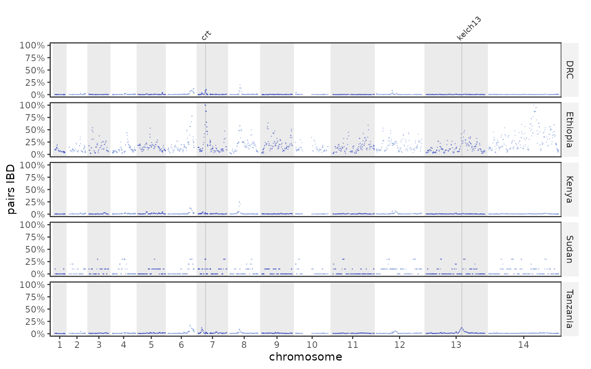
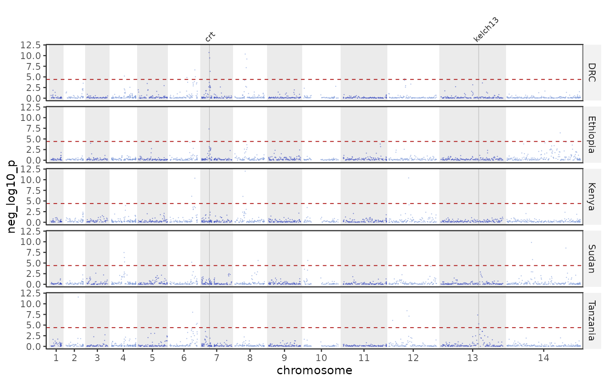
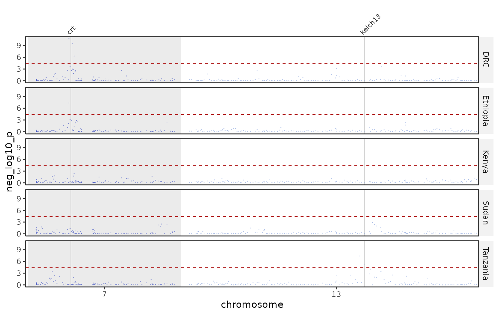
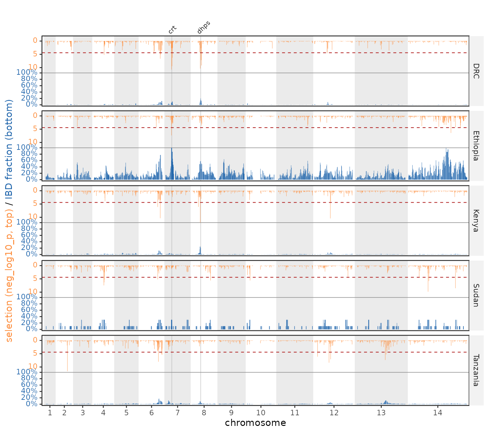
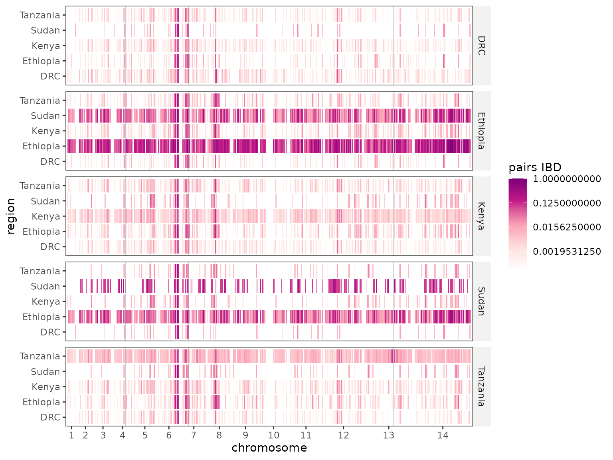

# IBD analysis

`plasgenomicsutilsR` plots identity-by-descent (IBD) results produced by
the companion Python package. You hand it the per-SNP, pairwise-region,
and selection-statistic tables; it draws genome-wide tracks, region
heatmaps, tug-of-war mirrors, and drug-gene triangles.

## Generating the input tables (`plasgenomicsutils`)

The tables come from the Python IBD tools, run on your `hmmibd-rs`
output, a SNP panel, a clean BCF, and a sample → region map. The
pipeline is:

``` bash
# 1. Binary (pairs x SNPs) IBD matrix from hmmibd-rs blocks + a SNP panel
plasgenomicsutils build_ibd_matrix \
  --blocks hmmibd_rs.hmm.tsv.gz --snps panel.vcf.gz --snp-format vcf \
  --output ibd_matrix.npz

# 2. Per-SNP-per-region and pairwise-region IBD summaries (needs the region map)
plasgenomicsutils analyze_ibd_matrix \
  --matrix ibd_matrix.npz --meta sample_regions.tsv --region-col region \
  --output ibd_analysis

# 3. Global + per-region allele frequencies, single pass over the BCF
plasgenomicsutils compute_allele_freqs \
  --bcf clean.snps.bcf --meta sample_regions.tsv --region-col region \
  --output allele_freqs

# 4. IBD selection statistic (XiR,s), genome-wide and per region
plasgenomicsutils ibd_selection_statistic \
  --matrix ibd_matrix.npz \
  --af allele_freqs.global.tsv.gz --af-region allele_freqs.per_region.tsv.gz \
  --meta sample_regions.tsv --region-col region \
  --output ibd_selection
```

Each command’s options are listed by
`plasgenomicsutils <command> --help`.

## The IbdResults container

[`ibd_results()`](https://nickjhathaway.github.io/plasgenomicsutilsR/reference/ibd_results.md)
ingests those tables (paths or data frames) and precomputes the
cumulative-genome coordinate the plots share. A small **public** example
dataset (five African countries) ships with the package:

``` r

ibd <- example_ibd_results()
ibd
#> <IbdResults>  reference: pf3d7 
#>   per_snp_region : 6785 rows 
#>   pairwise_region: 20355 rows 
#>   selection      : 6785 rows 
#>   thresholds     : 5 
#>   genes          : 5
```

On your own data, point it at the tool outputs:

``` r

ibd <- ibd_results(
  per_snp_region  = "ibd_analysis.per_snp_per_region.tsv.gz",
  pairwise_region = "ibd_analysis.per_snp_pairwise_region.tsv.gz",
  selection       = "ibd_selection.per_region.selection_stats.tsv.gz",
  threshold       = "ibd_selection.per_region.threshold.txt",
  genes           = EXAMPLE_DRUG_GENES,
  reference       = "pf3d7"
)
```

## Highlighting genes

The `genes` track supplies gene positions **and** display names.
`EXAMPLE_DRUG_GENES` is a small bundled track of drug-resistance loci:

``` r

EXAMPLE_DRUG_GENES
#>      name chr   start     end
#> 1     crt   7  403222  406317
#> 2    dhfr   4  748088  749914
#> 3    mdr1   5  957890  962149
#> 4    dhps   8  548200  550616
#> 5 kelch13  13 1724817 1726997
```

Pass `highlight_genes` to pick which to mark and `label_genes = TRUE` to
name them (top panel only, at each gene’s true position — labels are
never nudged off-position).

## Genome-wide tracks

Per-SNP IBD along the genome, faceted by region, with two drug genes
labelled:

``` r

plot_ibd_manhattan(ibd, highlight_genes = c("crt", "kelch13"), label_genes = TRUE)
```



The IBD selection statistic with the per-region Bonferroni threshold:

``` r

plot_selection_manhattan(ibd, metric = "neg_log10_p",
                         highlight_genes = c("crt", "kelch13"), label_genes = TRUE)
```



Every genome-wide plot can drop chromosomes (`chroms` / `skip_chr`, the
rest re-laid out contiguously):

``` r

plot_selection_manhattan(ibd, chroms = c("7", "13"),
                         highlight_genes = c("crt", "kelch13"), label_genes = TRUE)
```



## Tug-of-war

Selection hangs from the top, IBD rises from the bottom, sharing one
colour-coded axis. `scale = "common"` keeps panels comparable;
`scale = "free"` lets each region use its own maximum:

``` r

plot_ibd_tugofwar(ibd, highlight_genes = c("crt", "dhps"), label_genes = TRUE)
```



## Region-by-region sharing

IBD between region pairs along the genome; `trans = "log2"` and a
single-hue ramp keep it readable when most values are near zero:

``` r

plot_ibd_region_heatmap(ibd, trans = "log2")
#> Warning in ggplot2::scale_fill_gradientn(colours = colors, trans = trans, :
#> log-2 transformation introduced infinite values.
```



Triangles ask whether a gene (or a specific locus) is itself shared. A
gene’s cell aggregates **all** SNPs strictly inside it
(`agg = "mean"`/`"median"`/`"max"`):

``` r

plot_drug_gene_triangles(ibd)                              # one facet per gene
plot_drug_gene_triangles(ibd, snps = "Pf3D7_07_v3:403222") # a single locus
plot_drug_gene_triangles(ibd, individual = TRUE)           # a list, one plot per feature
```

## Saving

``` r

save_plot("ibd_tugofwar.pdf", plot_ibd_tugofwar(ibd))   # auto-sized; cairo PDF by default
```
