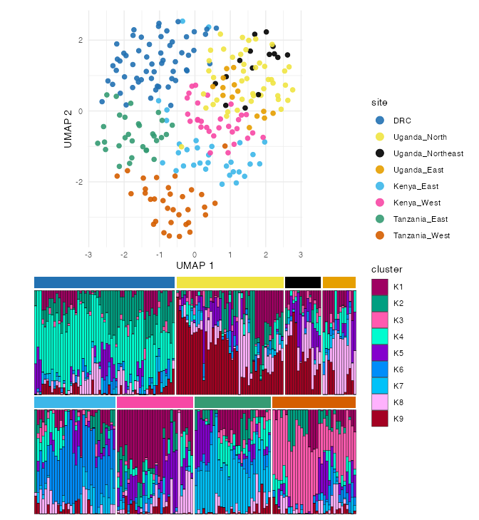

# Get started with plasgenomicsutilsR

`plasgenomicsutilsR` visualizes and analyzes the outputs of *Plasmodium*
genomics post-processing. It is the R companion to the Python package
[`plasgenomicsutils`](https://github.com/nickjhathaway/plasgenomicsutils),
which does the heavy compute (VCF filtering/harmonization, IBD analysis)
and writes plain tables this package reads and plots. Reference-genome
facts are namespaced by species
([`get_reference()`](https://nickjhathaway.github.io/plasgenomicsutilsR/reference/get_reference.md)),
so the tools generalize beyond *Plasmodium falciparum*.

## Install

The base install is CRAN-only; plotting/analysis dependencies are
optional `Suggests` (some from **Bioconductor**), so install them
Bioconductor-aware — see the
[README](https://github.com/nickjhathaway/plasgenomicsutilsR#install)
for the one-liners.

``` r

# install.packages("pak")
pak::pak("nickjhathaway/plasgenomicsutilsR", dependencies = TRUE)
```

## Three analysis areas

Each has its own article (see the **Articles** menu):

- **[IBD
  analysis](https://nickjhathaway.github.io/plasgenomicsutilsR/articles/ibd.md)**
  — genome-wide IBD & selection Manhattans, region × region heatmaps,
  tug-of-war mirrors, and drug-gene sharing triangles, from an
  `IbdResults` container over the Python IBD tool outputs.
- **[Population
  structure](https://nickjhathaway.github.io/plasgenomicsutilsR/articles/population-structure.md)**
  — PCA, UMAP and sNMF admixture in one `PopStructure` object, including
  a combined UMAP + admixture figure.
- **[Population
  differentiation](https://nickjhathaway.github.io/plasgenomicsutilsR/articles/differentiation.md)**
  — per-SNP Jost’s D / Gst / G′st / Fst between groups, a summary table,
  and a triangle heatmap.

A combined UMAP + admixture figure on the bundled public East-African
example (`example_pop_structure("africa")`):



All figures are ordinary ggplot objects;
[`save_plot()`](https://nickjhathaway.github.io/plasgenomicsutilsR/reference/save_plot.md)
writes them (sizing from how much was drawn, cairo PDF by default).
