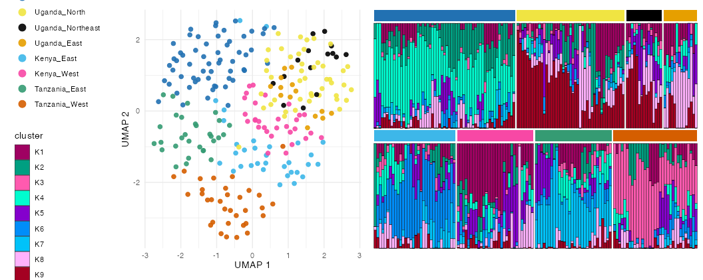

```{r setup, include = FALSE}
knitr::opts_chunk$set(collapse = TRUE, comment = "#>")
library(plasgenomicsutilsR)
```

`PopStructure` is an R6 workspace that bundles a genotype matrix, its PCA (the full
`prcomp`), an optional UMAP embedding, per-sample metadata, a **shared colour map**, and
an sNMF admixture fit — so PCA/UMAP/admixture colour and order consistently, and the whole
object can be `saveRDS`-ed and re-plotted without recomputing.

Two **public** example datasets ship with the package: `"ghana_cambodia"` (a minimal
two-population demo) and `"africa"` (258 East-African samples across DRC / Kenya / Tanzania
/ Uganda sites, built from the most differentiating SNPs so the structure is clear).

```r
ps <- example_pop_structure("africa")   # PCA + UMAP on the bundled genotypes
ps
ps$plot_pca(colour = "site")
ps$plot_umap(colour = "site")
```

Feed the UMAP a chosen number of PCs, or a **fraction of variance** to capture — the PCA
runs first and picks that many components (`n_pcs_for_variance()`) — and sub-select samples
(by id or metadata) for output:

```r
ps$run_umap(pca_components = 0.5)         # PCs covering 50% of the variance
west <- ps$subset(country = "Uganda")     # a new object limited to Uganda sites
```

Fix a metadata column's order once and it flows through every legend, facet and colour
strip; save and reload the whole workspace:

```r
ps$set_levels("site", c("DRC", "Uganda_North", "Uganda_Northeast", "Uganda_East",
                        "Kenya_East", "Kenya_West", "Tanzania_East", "Tanzania_West"))
ps$save("popstruct.rds")
ps2 <- load_pop_structure("popstruct.rds")
```

## Admixture (sNMF)

`run_snmf()` fits sNMF over a range of K via LEA — **cached and quiet** by default (it is
slow and prints a lot). `best_k()` picks K by cross-entropy; order the bars once with
`admixture_order()` and reuse that order across K:

```r
ps$run_snmf(K = 1:9)                        # re-runs are instant; no console spam
ord <- admixture_order(ps$q(ps$best_k()), meta = ps$get_meta(), group = "site")
ps$plot_admixture(K = ps$best_k(), group = "site", sample_order = ord)
```

### Choosing K

sNMF fits several replicates per K and scores each by cross-entropy. Two choices come out of
that, and both are made on the **minimum** across replicates:

- **Which replicate** — `q()` and `plot_admixture()` show the minimum-cross-entropy
  replicate at the chosen K. sNMF's objective is non-convex, so replicates settle in
  different local optima and the best-fitting one is the ancestry you draw.
- **Which K** — `best_k()` and the elbow compare those same minima across K, so the K you
  settle on is scored by the model you actually plot at it. This is also what LEA's own
  `plot()` of an sNMF project shows.

`stat = "mean"` averages the replicates instead, which is worth asking for when `n_runs`
differs between K values — a minimum over more replicates is expected to be smaller whether
or not that K fits better. Either way, treat a flat stretch or a wide min–max band as "the
data don't pin K down", whatever `best_k()` returns:

```r
ps$cross_entropy()        # K, n_runs, min, mean, max, best_run
ps$plot_cross_entropy()   # the elbow; best K in red, grey band = replicate spread
```

### Every K on its own page

`plot_admixture_multi_k()` returns a list of plots — the elbow first, then one page per K —
which `save_plot()` writes as a multi-page PDF. All pages share one sample order taken from
the best K, so a sample sits at the same x on every page and you can follow it as K changes.
The best K's page says so in its title:

```r
pages <- ps$plot_admixture_multi_k(group = "site", group_bar = TRUE, border = FALSE)
save_plot("admixture_all_k.pdf", pages)

# cross_entropy_first = FALSE   drop the elbow page
# sample_order_best_k = FALSE   let each K cluster its own samples
# sample_order = my_order       impose an order of your own
# K = 2:10, best_k = 6          narrow the pages / override which K is "best"
```

Clusters read `K1`, `K2`, … `K15` in numeric order, and the cluster legend always sits above
the group legend. At a large K that cluster legend is long, so `plot_admixture()` wraps it and
reports a canvas tall enough to hold the whole thing (`...` carries these through the pages
above). Down the side the keys wrap into extra columns; along the bottom they become a shallow
two-row block that adds to the height rather than squeezing the bars:

```r
ps$plot_admixture_multi_k(group = "site", legend_position = "bottom")
ps$plot_admixture(K = 15, legend_rows = 5)       # 5 keys per column -> 3 columns
ps$plot_admixture(K = 15, legend_position = "none")
```

## One combined figure

`plot_structure_figure()` draws the UMAP and the admixture as **one** figure sharing a
single theme (matching fonts), one region colour map (UMAP points match the admixture
colour strips), collected legends, region-faceted bars (a colour strip, no text) over
`rows` you specify, and the UMAP above (`"vertical"`) or beside (`"horizontal"`) it:

```r
rows <- list(c("DRC", "Uganda_North", "Uganda_Northeast", "Uganda_East"),
             c("Kenya_East", "Kenya_West", "Tanzania_East", "Tanzania_West"))
plot_structure_figure(ps, group = "site", K = "best_k", rows = rows,
                      orientation = "vertical", file = "figure2.pdf")   # auto-sized
```

```{r vertical, echo = FALSE, out.width = "70%", fig.alt = "Vertical composite UMAP + admixture"}
knitr::include_graphics("figures/popstruct-vertical.png")
```

The same call with `orientation = "horizontal"` puts the UMAP to the left:

```{r horizontal, echo = FALSE, out.width = "100%", fig.alt = "Horizontal composite UMAP + admixture"}

```

Per-sample bar borders (on by default) keep neighbours with nearly identical ancestry
distinct; `legend_point_size`, `point_size`/`point_alpha` tune the UMAP.

## From your own data

Build from a genotype matrix, or read a VCF with `load_genotypes()` (SNPRelate), then attach
metadata — colours are auto-assigned per column and reused across every plot:

```r
geno <- load_genotypes("clean.snps.vcf.gz")           # LD-pruned by default
ps <- PopStructure$new(geno, meta = sample_meta)      # sample, region, country, ...
ps$run_umap(pca_components = 10)
ps$run_snmf(K = 1:8, cache_dir = "snmf_cache")        # persistent cache survives sessions
```

### Both SNP panels in one object

LD pruning keeps one SNP out of each correlated run. That is what you want for PCA, UMAP and
admixture, where a correlated block would otherwise dominate the structure — and the opposite
of what you want wherever that correlation *is* the signal: differentiation, diversity, LD,
haplotype scans, haplotype plots. Rather than juggling two objects, register both panels and
let each analysis take the one it needs:

```r
ps$add_panel("full", load_genotypes("clean.snps.vcf.gz", prune = FALSE))
ps$panels()            # "pruned" "full"

ps$plot_pca()          # the pruned panel, as before
pop_diff(ps)           # the full panel, automatically
ps$genotype("full")    # or ask for one by name
```

The GDS is reused between the two calls, so the second is only a read. Any other panel works
the same way (`ps$add_panel("core", ...)`), and `genotype = ` still overrides everything.
Without a full panel, the analyses that want one say so once rather than quietly using pruned
SNPs.

## Ordering the groups

Groups read in a natural sort by default (so `site2` precedes `site10`). `set_levels()`
imposes your own order, and it applies to **every** output — PCA and UMAP legends, the
admixture facets and sample sweep, the differentiation matrix, and the composite figure:

```r
ps$set_levels("site", c("Uganda_North", "Uganda_East", "Kenya_West", "Kenya_East",
                        "Tanzania_West", "Tanzania_East", "DRC"))
```

Two things to know. Levels you leave out are dropped, so those samples vanish from the
plots — `admixture_order()` warns when that happens rather than shrinking the figure
silently. And in a *clustered* heatmap the clustering decides the axis order, since that
grouping is the point of clustering; see `plot_diff_heatmap(cluster = FALSE)` in the
differentiation article for an axis that follows the levels exactly.
